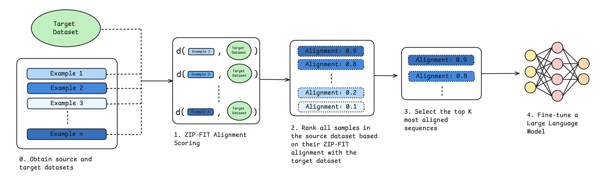

# Data Selection for Language Models via Compression
[](https://opensource.org/licenses/MIT)
[](https://arxiv.org/abs/2410.18194)

This repository hosts the [ZIP-FIT](https://arxiv.org/abs/2410.18194) data selection framework, designed to effectively and efficiently select relevant training data for language models from any data source based on a specified target dataset.

ZIP-FIT is optimized for:
- Rapid, large-scale data selection from extensive raw text datasets.
- Identifying data that closely aligns with the distribution of a given target dataset (e.g., domain-specific data, HumanEval, etc.).

Compute needed:
- 1 CPU node



## Quickstart

Install with pip:
```
pip install zip-fit
```

To select data, simply initialize a `ZIPFIT` object and call the following functions:
```python
from zip_fit import ZIPFIT

source_dataset = <path>
target_dataset = <path>
top_k = 10000

zipfit = ZIPFIT(source_dataset, target_dataset, k=top_k, output_file="top_k_sequences.jsonl")
zipfit.run()
```
Executing this process will generate a jsonl file named 'top_k_sequences.jsonl', containing 10,000 documents. For optimal performance, it is recommended to use uncompressed jsonl files stored on local file storage for all data paths, and to utilize as many CPU cores as possible. You can provide custom functions for reading the data paths and extracting the text field from each example using the {source,target}_load_dataset_fn and {source,target}_parse_example_fn parameters in the constructor.
 

## Examples

HuggingFace datasets can also be used in either `source_dataset` or `target_dataset`. However, please note that streaming a large raw dataset directly may result in slow performance; this approach is better suited for target datasets:

```python
from zip_fit import ZIPFIT
from datasets import load_dataset

source_dataset = f'/path/to/source.jsonl'
target_dataset = 'openai/openai_humaneval'

# Define the function to load the target dataset
def target_load_dataset_fn(dataset):
    ds = load_dataset(dataset, split='test', trust_remote_code=True)
    return ds

# Define the function to parse examples from the target dataset
def target_parse_example_fn(ex):
    text = f"Problem description: {ex['prompt']} \nCanonical solution: {ex['canonical_solution']}"
    return text

# Create an instance of ZIPFIT
zip_fit_instance = ZIPFIT(
    source_dataset=source_dataset,
    target_dataset=target_dataset,
    target_load_fn=target_load_dataset_fn,
    target_parse_fn=target_parse_example_fn,
    k=100000,  
    output_file="top_k_sequences.jsonl",
    compression_algorithm='gzip'  # Change to 'lz4' if desired
)

# Run the ZIPFIT process
zip_fit_instance.run()
```
You can specify different compression algorithms. The ZIP-FIT paper uses gzip, however other compression algorithms like lz4 are faster. 


## Citation Information
Paper: <https://arxiv.org/abs/2410.18194>
```
@article{obbad2024zipfit,
  author = {Elyas Obbad and Iddah Mlauzi and Brando Miranda and Rylan Schaeffer and Kamal Obbad and Suhana Bedi and Sanmi Koyejo},
  title = {ZIP-FIT: Embedding-Free Data Selection via Compression-Based Alignment},
  year = {2024},
  journal = {arXiv preprint arXiv:2410.18194},
}
```
